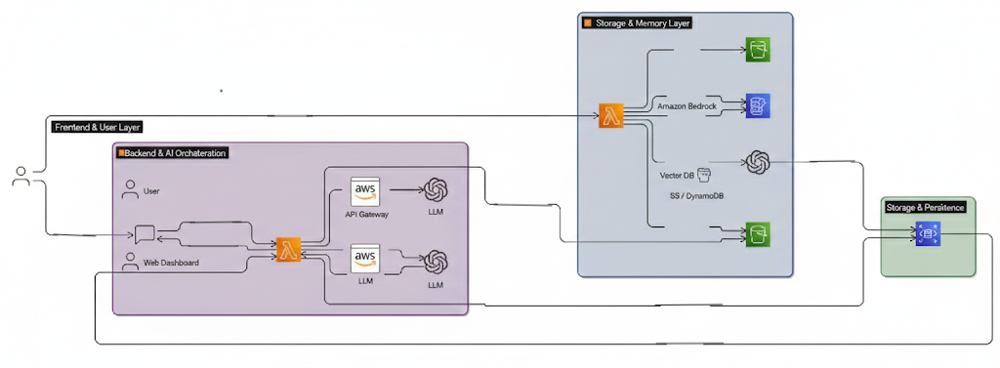

# Bharat Multi-Agent AI Knowledge OS

---

## Problem Statement

Students and developers in India face fragmented learning resources, language barriers, and a lack of personalized guidance when studying complex technical subjects. Existing platforms are reactive, single-purpose, and fail to adapt to individual learning patterns or learning progress over time.

---

## Solution

Bharat Multi-Agent AI Knowledge OS is an AI-powered learning platform that leverages multiple collaborating AI agents, document-grounded reasoning, and persistent memory to deliver structured, personalized, and multilingual learning support tailored to individual users.

---

## Key Features

- Multi-agent AI collaboration for structured reasoning  
- Document-based learning using Retrieval-Augmented Generation (RAG)  
- Personalized learning roadmap generation  
- Beginner-friendly code debugging and explanation  
- Persistent user memory for adaptive learning  
- Multilingual support for wider accessibility  
- Serverless and cost-efficient cloud architecture  

---

## System Architecture

The platform is built using a layered, serverless AWS architecture designed for scalability, cost efficiency, and modularity. The frontend manages user interaction, while backend serverless services orchestrate multi-agent AI workflows. Retrieval-Augmented Generation ensures responses are grounded in user-provided documents, and a persistent memory layer enables adaptive personalization over time.

---

## Technology Stack

- **Frontend:** React / Next.js  
- **Backend:** AWS Lambda  
- **API Layer:** Amazon API Gateway  
- **AI Layer:** Amazon Bedrock  
- **Storage:** Amazon S3  
- **Memory Store:** Amazon DynamoDB  
- **Retrieval Layer:** Vector embeddings and semantic search  

---

## How It Works

1. Users upload PDFs or submit learning queries  
2. Backend services orchestrate multi-agent workflows  
3. Relevant document context is retrieved using RAG  
4. AI agents collaborate to generate grounded responses  
5. User learning memory is updated for personalization  
6. Final responses are delivered to the frontend in near real-time  

---

## Security and Privacy

- User-isolated document and data storage  
- Encryption at rest and in transit  
- No cross-user data access  
- Secure, stateless API design  

---

## MVP Scope

The MVP focuses on delivering:

- Two to three collaborating AI agents  
- A functional RAG pipeline  
- Persistent user memory storage  
- A clean and intuitive web dashboard  

---

## Future Roadmap

- Knowledge graph–based reasoning  
- Voice-based AI tutoring  
- Offline-first support for low-bandwidth environments  
- Campus-level and institutional deployments  
- Expansion into national-scale education platforms  

---

## Hackathon Readiness

This project is:

- Fully aligned with AWS-native services  
- Cost-efficient and scalable for student deployments  
- Designed with production-readiness in mind  
- Focused on delivering real-world impact in India  

---

## Team

- **Ayushi Tewari**  
- **Soumya Gupta**  
- **Rakshith Ganjimut**  
- **Nirvik Goswami**  
